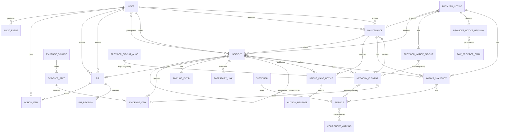
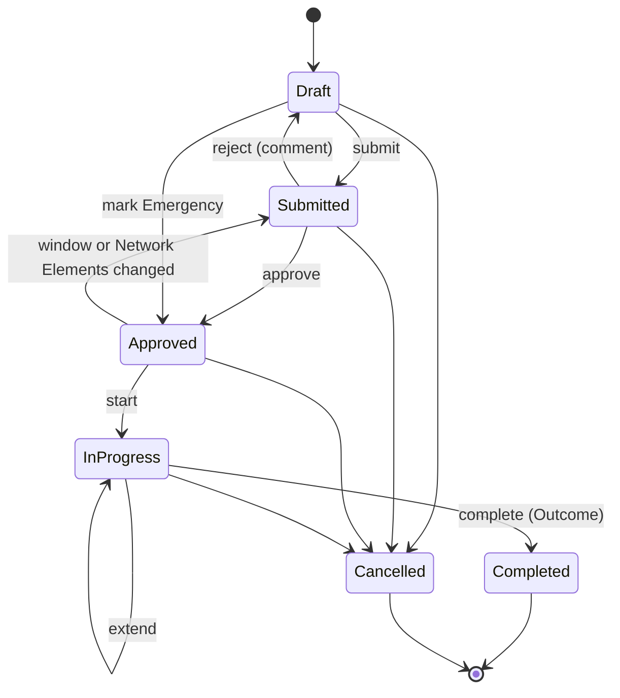
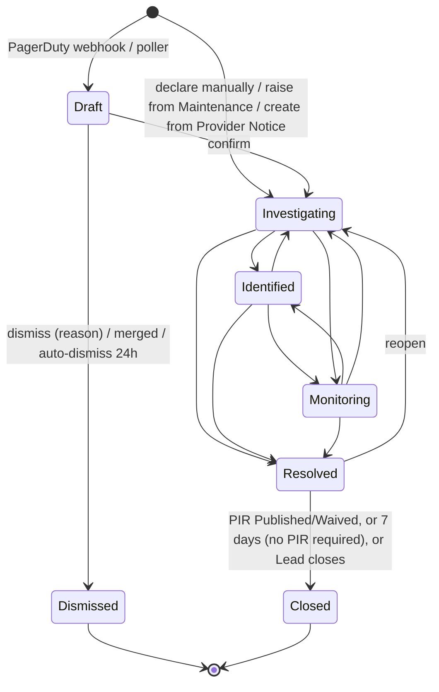
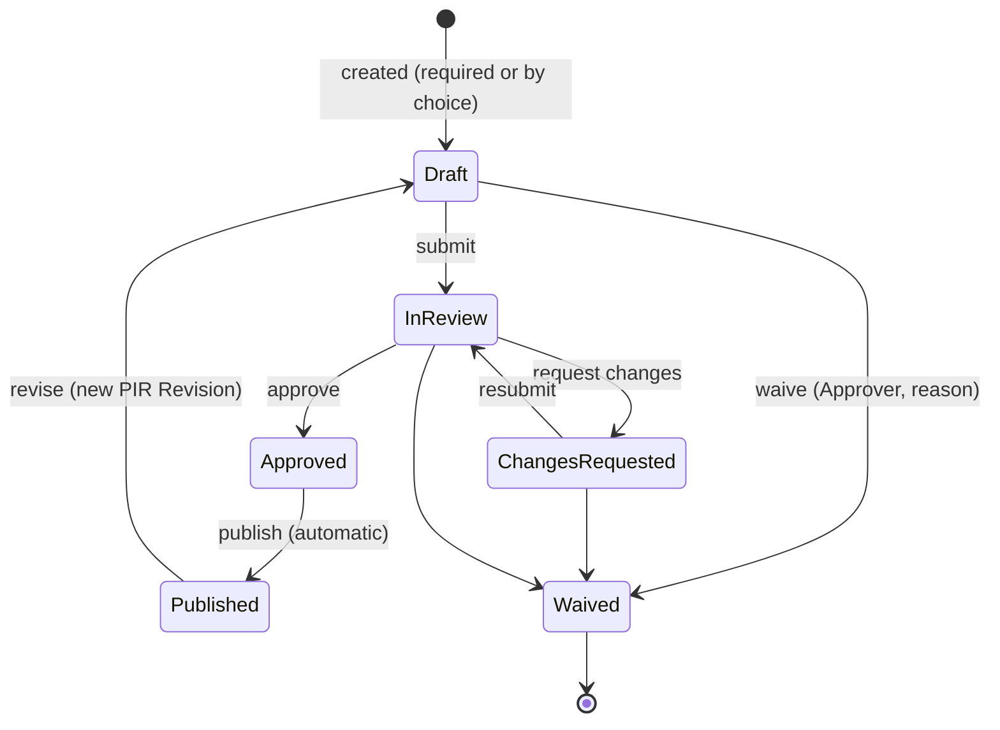
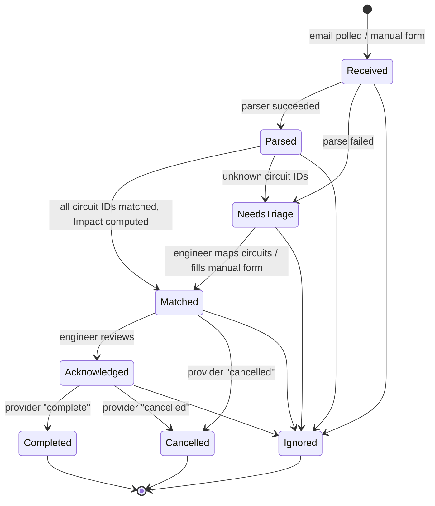
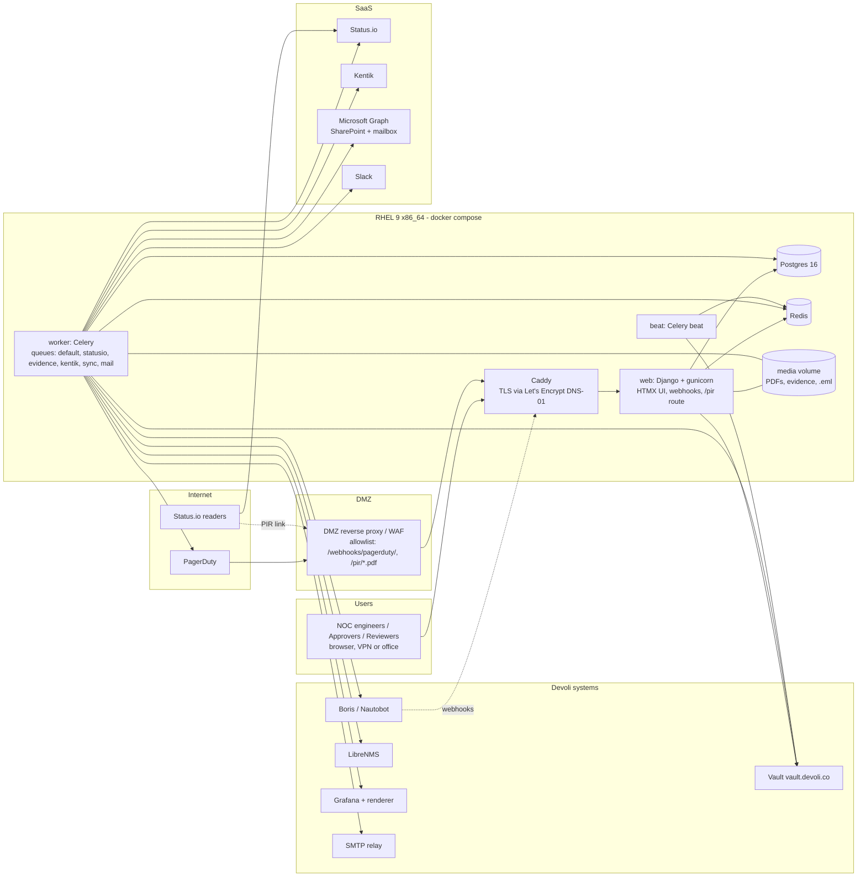

# Devoli Outage Manager: product and architecture spec (MVP)

Status: consolidated spec for the MVP build. Glossary terms follow [`CONTEXT.md`](../CONTEXT.md) exactly.
Where sources conflicted, the rule was: later decisions override earlier research, and user decisions override
recommendations. The resolutions are listed in [§12.3](#123-contradictions-resolved-in-this-spec).

---

## 1. Purpose, users and scope

### 1.1 Purpose

Outage Manager is Devoli's internal tool for planning, approving and announcing **Maintenance**, and for running
**Incidents** from detection to **Post-Incident Report (PIR)**. It works out **Impact** from Boris (Devoli's Nautobot
fork), publishes **Status Page Notices** to Status.io, and records **Outcome** and evidence. It replaces the existing
Zendesk-plugin tool. There is no history migration: a short parallel run, then cutover.

### 1.2 Users

| User | Role(s) | Main use |
|---|---|---|
| NOC engineers | **Author** | Create Maintenance, declare and run Incidents, triage Draft Incidents and Provider Notices, write PIRs, publish to Status.io |
| Senior engineers / managers | **Approver** | Approve Maintenance, sign off Emergency Maintenance, waive PIRs |
| Team manager (default) | **PIR Reviewer** | Review and approve PIRs before publication |
| Platform owners | **Admin** | Users, settings, templates, Component Mapping, Evidence Specs, integrations |
| Other staff | **Viewer** | Read-only |
| Support staff and Customers | (no account) | Receive Status Page Notices by subscribing to Status.io |

A user can hold several roles.

### 1.3 Scope

**In scope (MVP):** the 12 modules in [§9](#9-mvp-modules-in-build-order). They cover the Maintenance, Incident, PIR and Provider Notice lifecycles, the Boris mirror and Impact, Status.io publishing, PagerDuty Draft Incidents, SharePoint PIR publishing, Evidence (LibreNMS, Grafana, Kentik), Slack NOC Channel alerts, reminders, audit, and passkey auth.

**Out of scope:**
- Replacing PagerDuty or any alerting or on-call tool.
- Writing back to PagerDuty or acknowledging its incidents. An optional "tracked in Outage Manager" note is the most that would ever be added, and it is not in the MVP.
- Migrating history from the existing tool.
- SSO or any external identity provider.
- Zendesk, in any form. Status.io is the only external notification channel.
- Publishing Provider Notices directly to Status.io.
- Django admin as a configuration surface. All configuration lives in the main app.

**Deferred until after the MVP:** see [§11](#11-deferred--future-work). In short: the Observium adapter, custom NZ carrier parsers (unless sample emails arrive), Maintenance before/after health checks, NMS alert suppression, Maintenance conflict detection, reporting/SLA dashboards, data-quality reports beyond a basic unmapped list, and LLM parsing.

---

## 2. Domain model

This is a spec-level model, not a Django model file. Every record has `id`, `created_at`, `created_by` and `updated_at`. All times are stored in UTC and shown in `Pacific/Auckland`.

### 2.1 Entities

| Entity | Key fields | Relationships / notes |
|---|---|---|
| **Maintenance** | `number` (MNT-000123), `title`, `description` (internal), `public_summary`, `state`, `window_start`, `window_end`, `is_emergency`, `is_provider_driven`, `notice_justification`, `outcome`, `actual_start`, `actual_end`, `extensions[]`, `emergency_signed_off_by/at`, `flagged_for_review` (+ reason), `publish_when_low_impact` | Author (User), Approver (User), Network Elements (M2M), Impact Snapshots, Status Page Notices, linked Provider Notices, Incidents raised from it |
| **Incident** | `number` (INC-000123), `title`, `state` (includes `DRAFT`, `DISMISSED`), `priority` (P1–P4), `pir_required`, `dismiss_reason` (false alarm / duplicate / covered by a Maintenance / auto-resolved, not confirmed / other) + text, timestamps `impact_start`, `detected_at`, `acknowledged_at`, `mitigated_at`, `resolved_at`, `closed_at`, `likely_caused_by_maintenance` (FK), `auto_resolved_in_pd_at`, `merged_into` (FK self), `recurrence_of` (FK self) | Incident Lead (User), Participants (M2M User), Network Elements, Impact Snapshots, Timeline Entries, PagerDuty links, PIR (0..1), Evidence Items, Status Page Notices, source Maintenance (0..1), linked Provider Notices |
| **Draft Incident** | Not a separate table: an **Incident** in state `DRAFT`, created from PagerDuty | Ends as Investigating (confirmed) or **Dismissed** |
| **PagerDuty Incident Link** | `pd_incident_id` (unique), `pd_number`, `html_url`, `pd_service_id`, `title`, `urgency`, `pd_priority`, `status`, `hostnames[]`, `raw` | Many per Incident (correlation and merge). Moves between Incidents on merge or split |
| **PagerDuty Webhook Event** | `webhook_id` (unique, `X-Webhook-Id`), `event_id`, `event_type`, `subscription_id`, `received_at`, `raw`, `processed_at`, `error` | Delivery dedup and replay log |
| **Timeline Entry** | `at`, `kind` (manual / state / priority / pagerduty / lead_handover / publish / evidence), `text`, `actor`, `source_ref`, `raw` | Belongs to Incident. The PIR timeline is trimmed from it |
| **PIR** | `state`, `author` (default: Incident Lead), `reviewer`, `current_revision`, `submit_due_at` (5 business days after Resolved), `waived_by`, `waive_reason`, `sharepoint_drive_id`, `sharepoint_item_id`, `sharepoint_etag`, `public_link` (Anyone link or `/pir/INC-….pdf`), `statusio_link_confirmed_by/at` | 1:1 with Incident. Has PIR Revisions, Action Items and selected Evidence Items |
| **PIR Revision** | `version` (1..n), public fields (Summary, Customer impact, Timeline rows, Root cause, Resolution, Prevention), internal fields (Contributing factors, What went well / didn't), `submitted_at`, `approved_by/at`, `published_at`, `public_pdf`, `internal_pdf`, `pdf_sha256`s, `review_comments[]` | Immutable once Approved. A change after publication creates the next version |
| **Action Item** | `description`, `owner` (User), `due_date`, `status` (Open / Done / Cancelled), `completed_at` | Belongs to PIR. Overdue list; never blocks close |
| **Evidence Source** | `kind` (librenms / grafana / kentik), `name`, `base_url`, `cluster` (Kentik), `vault_path` (credentials), `timezone`, `enabled`, capability flags | Configured by Admin in the app |
| **Evidence Spec** | `name`, `source` (FK), `applies_to` (device / interface / circuit, plus optional role/tag filter), `params` (source-specific JSON: LibreNMS graph name; Grafana dashboard UID, panel ID, variable mapping; Kentik query template), `pad_before`/`pad_after` (default 1 h), `enabled` | Admin-configured per Network Element type |
| **Evidence Item** | `incident`, `spec` (nullable for manual), `network_element` (nullable), `kind` (captured / manual upload / live link), `status` (ok / failed), `error`, `file` (PNG), `data_json`, `sha256`, `content_type`, `source_url` (secrets removed), `request_params`, `range_start`, `range_end`, `fetched_at`, `included_in_pir`, `is_public` | **Immutable.** A refresh creates new items |
| **Provider Notice** | `provider` (Boris Provider), `provider_ref` (`maintenance_id`), `kind` (maintenance / outage), `state`, `window_start/end`, `provider_status`, `provider_reported_start/complete`, `claimed_by`, `acknowledged_by/at`, `ignore_reason`, `tz_assumed` flag | Unique `(provider, provider_ref)`. Has Revisions, Raw Emails, Circuit refs, an Impact Snapshot, and links to Maintenance/Incident |
| **Provider Notice Revision** | `sequence`, `stamp`, `uid`, parsed fields, `parser`, `generated_by_llm` (always false in MVP), `raw_email` (FK) | Immutable. Ordered by (sequence, stamp) |
| **Raw Provider Email** | `message_id` (unique), `sha256` (unique), `from`, `to`, `subject`, `date`, `received_at`, `mailbox_id`, `eml` file, `parse_result`, `error` | Immutable `.eml` on evidence storage |
| **Provider Notice Circuit** | `cid_raw`, `cid_normalised`, `circuit` (FK mirror, nullable), `provider_impact` | Unmatched when `circuit` is null |
| **Provider Circuit Alias** | `provider`, `alias` (normalised), `circuit` (FK), `created_by` | Maintained in Outage Manager, never written back to Boris |
| **Network Element (mirror)** | `boris_id` (UUID), `type` (device / interface / circuit), `name`, `device` (for interfaces), `location`, `role`, `status`, `tags`, `custom_fields`, `external_ids` (`librenms_device_id`, `kentik_device_id`, …), `synced_at` | Read-only copy of Boris. Includes connectivity edges (connected endpoint, cable path, circuit terminations, LAG/parent, VLANs) |
| **Service (mirror)** | `boris_ref`, `name`, `service_type`/tags, `location`/region, `customer` (FK) | Derived by configured rules from Boris objects (Circuit, VLAN, …); its exact Boris representation is an assumption to verify |
| **Customer (mirror)** | `boris_tenant_id`, `name`, `tenant_group` | Customer = Boris Tenant |
| **Impact Snapshot** | `record` (Maintenance / Incident / Provider Notice), `taken_at`, `taken_by`, `trigger` (submit / publish / recompute), `items[]`: `{service, customer, impact_level, computed_level, source: computed \| added \| removed \| overridden, reason}`, `overall_level` (worst), `components[]` (Status.io pairs) | Author-confirmed. Immutable; a new one is taken each time |
| **Component Mapping** | Rule rows: `match_kind` (service type / tag / location / region), `match_value`, `target` (Status.io component ID or container ID), `priority` | Plus a cached registry of Status.io components and containers |
| **Status Page Notice** | `record` (Maintenance / Incident), `kind` (incident create / update / resolve, maintenance schedule / start / update / finish / delete, PIR link), `statusio_id`, `message_id`, `status_code` (300/400/500), `state_code`, `body`, `notify_channels`, `outbox_message` (FK), `posted_at`, `posted_by` | Message text rendered from in-app templates, editable before posting |
| **Message Template** | `event` (e.g. `maintenance.scheduled`, `incident.identified`), `subject`, `body` (Django template syntax), `updated_by` | Admin-edited |
| **Outbox Message** | `target` (statusio / sharepoint / slack / email / pagerduty-read), `operation`, `idempotency_key` (unique), `payload`, `status` (pending / sending / sent / failed / needs_reconcile), `attempts`, `next_attempt_at`, `response`, `external_id`, `last_error` | See [§6.4](#64-outbox-and-idempotency-for-external-posts) |
| **User** | `username`, `email`, `is_active`, groups = roles (Author, Approver, PIR Reviewer, Admin, Viewer), authenticators (passkeys, TOTP, recovery codes) | Invite-only; deactivated, never deleted |
| **Audit Event** | `at`, `actor` (User or `system:<integration>`), `action`, `object_type`, `object_id`, `before`, `after` (JSON diff), `reason`, `ip`, `user_agent`, `request_id` | Append-only. See [§8.3](#83-audit-events) |
| **Setting** | Key/value app config (hostnames, Correlation Window, PagerDuty priority mapping, default PIR Reviewer, Status.io page ID, SharePoint site/library IDs, Slack channel) | Secrets never stored here; only Vault paths |

### 2.2 ER diagram



---

## 3. Lifecycles

Every transition writes an Audit Event and, for Incidents, a Timeline Entry. "Side effects" run after the transaction commits, through the outbox ([§6.4](#64-outbox-and-idempotency-for-external-posts)).

### 3.1 Maintenance



| Transition | Who | Guards | Side effects |
|---|---|---|---|
| create | Author | – | Draft; the Author picks Network Elements and Impact is computed live |
| submit | Author | Required fields; Impact Snapshot confirmed; if `window_start` is less than the Notice Period away, and the Maintenance is not Emergency or provider-driven, a written justification is required (a warning, not a block) | Snapshot saved (`trigger=submit`); Approvers notified (email + in-app) |
| reject | Approver | Approver ≠ Author; comment required | Back to Draft with the comment |
| approve | Approver | Approver ≠ Author; Notice Period re-evaluated and shown | Status.io `maintenance/schedule` with reminders at 72h, 24h and 1h, unless the Impact is only NO-IMPACT / REDUCED-REDUNDANCY and the Author did not opt in. On re-approval after a change: delete + re-schedule with a "rescheduled" note |
| mark Emergency | Author | Reason required | Goes straight to Approved and is published like approve (with notify-now). Needs Emergency sign-off by a *different* Approver (≠ Author) within 1 NZ business day; it is listed on the dashboard until signed off; overdue → NOC Channel alert |
| sign off Emergency | Approver | Approver ≠ Author | Clears it from the sign-off list |
| edit (Approved) | Author | Changing the window or Network Elements returns it to Submitted (the Status.io maintenance stays until re-approval). Text-only edits do not | Snapshot recomputed on resubmit |
| start | Author | State Approved | Status.io `maintenance/start` (update); NOC Channel "Maintenance starting"; reminder to the Author if the window opens without a start |
| extend | Author | In Progress; new end > current end | No re-approval; logged; Status.io `maintenance/update` |
| complete | Author | Outcome required (Successful / Partially successful / Rolled back / Failed) | Status.io `maintenance/finish`; reminder to the Author if the end passes while still In Progress |
| raise Incident | Author | In Progress or Completed | New Incident (Investigating) linked to the Maintenance; the Maintenance continues |
| cancel | Author or Approver | Not Completed | If published: Status.io `maintenance/delete` with subscriber notice (see [§10](#10-assumptions-to-verify)) |
| accept provider change | Author | `flagged_for_review` set by a Provider Notice revision | The Author applies the new window/Impact; a window change sends it back to Submitted |

### 3.2 Incident (including Draft and Dismissed)



| Transition | Who | Guards | Side effects |
|---|---|---|---|
| create Draft | system (PagerDuty) | No correlating open Draft/Incident ([§4.4](#44-correlation)) | Priority pre-filled from PagerDuty priority mapping; NOC Channel "new Draft Incident"; tagged "likely caused by Maintenance" if its Network Elements are covered by an In Progress Maintenance |
| declare | Author | – | Investigating; declarer becomes Incident Lead |
| confirm | Author | Draft | Investigating; confirmer becomes Lead unless one was chosen; starts the 15-min P1/P2 publish clock |
| dismiss | Author | Draft; reason required | Dismissed (final) |
| merge | Author | Source is Draft; target is Draft or Incident before Resolved | PagerDuty links and timeline moved to the survivor; the source becomes Dismissed ("duplicate") with `merged_into` |
| split | Author | Target has more than one PagerDuty link | The selected PagerDuty link moves to a new Draft |
| auto-dismiss | system | Draft, PagerDuty resolved, no action for 24h | Dismissed ("auto-resolved, not confirmed") |
| Identified / Monitoring / back | Incident Lead | Not Draft/Closed | If published: an update box with a suggested message from the template; the Lead posts it |
| set Priority | Incident Lead | Any open state | Logged. Raising to P1/P2 sets `pir_required=true`; lowering never clears it |
| handover Lead | Incident Lead or any Author taking over | – | Logged |
| edit timestamps | Incident Lead | – | Each edit logged (before/after) |
| publish to Status.io | any Author | Not Draft; preview confirmed; Status.io status confirmed | `incident/create` (state 100 or current) |
| resolve | Incident Lead | – | `resolved_at` set; Evidence capture queued; PagerDuty log entries snapshotted; Status.io `incident/resolve` if published; PIR `submit_due_at` = +5 NZ business days if a PIR exists or is required |
| reopen | Incident Lead or Author | Resolved | Investigating; logged |
| close | system or Lead | If `pir_required`: only when the PIR is Published or Waived (automatic). Otherwise automatic 7 days after Resolved, or earlier by the Lead | Closed is final. A recurrence becomes a new Incident with `recurrence_of` |

### 3.3 PIR



| Transition | Who | Guards | Side effects |
|---|---|---|---|
| create | system (P1/P2) or Author | Incident exists (PIRs attach to Incidents only) | Pre-filled from Incident (Impact Snapshot, times, trimmed timeline, Priority). Author defaults to the Incident Lead; Reviewer defaults to the configured PIR Reviewer |
| edit | PIR Author, Participants | Draft or Changes Requested | Rich text (bold, lists, links only); blameless-language guidance |
| refresh evidence | PIR Author | Draft | New Evidence Items are captured ([§5.5](#55-librenms-grafana-kentik-evidence)) |
| submit | PIR Author | Required fields filled; a Reviewer is set, and the Reviewer ≠ Author and ≠ Incident Lead | Public PDF preview rendered; Reviewer notified |
| request changes | Reviewer | Comment required | Author notified |
| approve | Reviewer | Has viewed the Public PDF preview | Revision frozen |
| publish | system | Approved | Render Public + Internal PDFs (WeasyPrint); upload the Public PDF to SharePoint (and optionally the Internal PDF to a restricted library); set `public_link`; prompt the Reviewer to add the link in the Status.io dashboard (deep link given) and confirm; Incident closes if it is Resolved and a PIR is required |
| revise | PIR Author | Published | New revision (Draft → review again). Republishing overwrites the same SharePoint item, so the link is unchanged; the PDF shows "Revised <date>" |
| waive | Approver | Not Published; reason required; Approver ≠ PIR Author and ≠ Incident Lead | Waived (final); Incident closes if it is Resolved |
| hand over Author | PIR Author | – | Logged |

Deadline: submit for review within 5 NZ business days of the Incident being Resolved. Reminders and a dashboard overdue list apply; NOC Channel alert when overdue. Publication has no hard deadline.

### 3.4 Provider Notice



| Transition | Who | Guards | Side effects |
|---|---|---|---|
| receive | system (mailbox poller) or Author (manual form) | Dedupe on `Message-ID` / sha256 | Raw `.eml` stored; revision created |
| parse | system | Sender → Provider → parser registry | Parsed or Needs Triage; NOC Channel alert for Needs Triage |
| match | system | Provider + normalised cid (iexact) against the mirror, then aliases | Impact Snapshot on the notice; NOC Channel alert if the Impact is DEGRADED or OUTAGE |
| map circuit | Author | Unknown cid | Creates a Provider Circuit Alias (later notices auto-match); re-match |
| claim / acknowledge | any Author | Matched | Acknowledged |
| create Maintenance from notice | Author | Maintenance-type notice | A new Maintenance pre-filled (window, Network Elements, Impact), `is_provider_driven=true`, exempt from the Notice Period, normal approval |
| link to Maintenance | Author | – | Link stored |
| create Incident / link to Incident | Author | Outage-type notice (flagged) | New Investigating Incident or a link to an existing/Draft Incident. Draft Incidents are never created automatically from notices |
| provider update (new revision) | system | Newer by (sequence, stamp); older revisions stored as out-of-sequence | Impact recomputed; linked Maintenance `flagged_for_review` (never changed automatically); provider cancellation prompts the Author to cancel the Maintenance; "work started / complete" times stored and shown on the linked Maintenance (they do not change its state) |
| ignore | Author | Reason required | Ignored (final) |

A NO-IMPACT or REDUCED-REDUNDANCY notice can be acknowledged without creating a Maintenance.

---

## 4. Business rules

### 4.1 Notice Period

- The **Notice Period** is 5 NZ business days between Submission (and again at approval) and `window_start`, for all planned work, whatever the Impact.
- Business days exclude Saturdays, Sundays and **NZ national public holidays** (the holiday calendar is computed with the `holidays` library, `NZ` country, no regional anniversary days). Holidays that are "Mondayised" count as holidays.
- Shorter notice is **not blocked**. It shows a warning and needs a written justification, which is stored on the Maintenance and shown to the Approver.
- **Exempt:** Emergency Maintenance and Provider-driven Maintenance.
- The same business-day calculator is used for the Emergency sign-off deadline (1 business day) and the PIR submit deadline (5 business days after Resolved).

### 4.2 PIR requirement

- A PIR is **required for P1 and P2**, optional for P3 and P4.
- Raising an Incident to P1/P2 at any time sets `pir_required`. Lowering the Priority never clears it; only an **Approver waiver** with a reason does (PIR → Waived).
- An optional PIR can be started by any Author on a P3/P4 Incident; once started it follows the same lifecycle.
- PIRs attach to **Incidents only**. A failed Maintenance that affected Customers gets a PIR through "Raise Incident".
- If a PIR is required, the Incident closes only when the PIR is Published or Waived. Action Items never block closing.

### 4.3 Approval separation (no one approves their own work)

| Approval | Rule |
|---|---|
| Maintenance approval / rejection | Approver ≠ Maintenance Author. One Approver is enough |
| Emergency Maintenance sign-off | Approver ≠ the Author who marked it Emergency |
| PIR approval | PIR Reviewer ≠ PIR Author **and** ≠ Incident Lead. Exactly one Reviewer |
| PIR waiver | Approver ≠ PIR Author |

The rules are checked server-side in the transition service (not only hidden in the UI). An Admin cannot bypass them. The PIR Reviewer and Maintenance Approver roles are separate, and one person can hold both.

### 4.4 Correlation

When a PagerDuty `incident.triggered` arrives (webhook or poller) for an unknown `pd_incident_id`:

1. Fetch the incident and its alerts, and extract hostnames from `custom_details` (LibreNMS JSON template: `hostname`, `sysName`, `ports[].ifName`).
2. Resolve hostnames to Network Elements through the NMS/Boris mapping: exact `hostname` → `sysName` → IP, against `external_ids` and names in the mirror.
3. Find open Drafts/Incidents (any state before Resolved) that have **the same PagerDuty service AND overlapping Network Elements**, where a linked PagerDuty incident was triggered within the **Correlation Window** (default 30 min, an Admin setting).
4. If one matches, attach the PagerDuty link (and a timeline entry) to the most recent match. Otherwise create a new Draft.
5. If no hostnames resolve, only the same PagerDuty service within the window counts as a match **when** the existing record also has no Network Elements. Otherwise create a new Draft. (Interpretation: a match with unknown elements can't satisfy "overlapping".)
6. A Draft whose Network Elements are covered by an In Progress Maintenance is tagged "likely caused by Maintenance" and linked. It is never dismissed automatically.
7. A Draft whose PagerDuty incident resolves before confirmation is marked "auto-resolved in PagerDuty". After 24 h with no action it becomes Dismissed ("auto-resolved, not confirmed").

Merge and split are manual ([§3.2](#32-incident-including-draft-and-dismissed)).

### 4.5 Impact computation and override

**Computation** (runs on the local Boris mirror, never live against Boris):

1. Start from the selected Network Elements (device, interface, circuit).
2. Device → all its interfaces (including subinterfaces and LAG members), plus the device's own tenant if set.
3. Interface → walk the **physical downstream tree**: connected endpoint over cable paths; circuit terminations → circuit → far termination → onward. Recurse downstream until customer-owned endpoints (CPE / tenant-owned devices) or circuit tenants are reached. A cycle guard and a depth limit (Admin setting, default 10) apply.
4. Also collect the **VLANs on affected interfaces** (untagged and tagged) and the Services they carry.
5. Map the reached Boris objects to **Services** and **Customers** (Tenants) using the configured service rules ([§5.1](#51-boris-nautobot-fork)).
6. Default Impact Level per Service: the Author chooses a level per record (default OUTAGE for an Incident, a chosen level for a Maintenance). For Provider Notices, use the carrier's per-circuit impact.
7. The overall Impact is the **worst level** among the Services.

**Author override:** before submitting (Maintenance) or publishing (Incident), the Author sees the computed Services and can **add or remove Services, or override a Service's Impact Level**. Each change needs a reason. The confirmed list is saved as an immutable **Impact Snapshot**, with computed vs final values. A later recompute (for example after a Boris change or a Provider Notice revision) creates a new snapshot, but only when confirmed; it never silently replaces the published one.

**Unmapped:** Services that no Component Mapping rule matches are listed in the Impact view and on a basic "unmapped Services" report.

### 4.6 Status.io mapping (300/400/500)

**Component Mapping:** rules in Outage Manager translate Service type/tag → **component** (a product type, such as Fibre Broadband, Business Fibre, Voice, Transit, Data Centre), and Location/region → **container** (Auckland, Wellington, Christchurch…). A Service yields the pair `<component_id>-<container_id>`. There are no per-customer components. Nothing is written back to Boris. Components and containers are created in the Status.io dashboard; Outage Manager syncs their IDs (`GET /component/list`).

| Impact Level | Status.io `current_status` | Default |
|---|---|---|
| NO-IMPACT | – | Not published |
| REDUCED-REDUNDANCY | – (Author may publish at 300 with "at risk" wording) | Not published |
| DEGRADED | **300** Degraded performance | Published |
| OUTAGE (part of a component/container) | **400** Partial service disruption | Published |
| OUTAGE (a whole component/container down) | **500** Service disruption | Published |
| (security, manual only) | 600 | Never automatic |

- Status.io applies **one status per incident call** to all affected pairs, so Outage Manager sends the status derived from the **worst** Impact.
- The suggestion is 500 when every Service mapped to a component-container pair in the mirror is OUTAGE; otherwise 400. **The Author confirms the status before every publish.**
- Maintenance uses Status.io's own maintenance status (200) automatically.

### 4.7 Notification policy per transition

Status.io is the only external channel. Support staff subscribe like Customers. Message text comes from in-app **Message Templates** (Admin-edited), and the Author can always edit it before posting and switch off notification for an individual post. "All channels" = `notify_email`, `notify_sms`, `notify_webhook` (+ social/ChatOps flags as configured); "email only" = `notify_email=1`, others 0. The per-event channel mapping is an Admin setting; defaults below.

| Record / transition | Status.io call | Trigger | Subscriber channels (default) | Internal (NOC Channel / email) |
|---|---|---|---|---|
| Maintenance approved (or Emergency) | `maintenance/schedule` with reminders at 72h / 24h / 1h (Emergency: `notify_now=1`); `automation=0` | Automatic (skipped for NO-IMPACT / REDUCED-REDUNDANCY only unless the Author opts in) | All (maintenance scheduled) | Emergency: "sign-off needed" to Approvers |
| Maintenance started | `maintenance/start` | Author action | Email only | NOC Channel "Maintenance starting" |
| Maintenance extended | `maintenance/update` | Author action | Email only | – |
| Maintenance completed | `maintenance/finish` | Author action | All (resolution) | – |
| Maintenance cancelled | `maintenance/delete` (subscribers notified: see [§10.6](#106-statusio-publishing)) | Author action | All | – |
| Maintenance rescheduled (after re-approval) | `maintenance/delete` + `maintenance/schedule` with a "rescheduled" note | Automatic on re-approval | All | – |
| Draft Incident created | – | – | – | NOC Channel "new Draft Incident" |
| Incident published | `incident/create` (state = current) | Explicit "Publish to Status.io" with preview; any Author; expected within 15 min of confirmation for P1/P2, optional for P3/P4 | All (new incident) | NOC Channel alert if a P1/P2 is unpublished after 15 min |
| Incident → Identified / Monitoring | `incident/update` (state 200 / 300) | Update box with suggested message; the Lead posts | Email only | – |
| Incident resolved | `incident/resolve` | Update box; the Lead posts | All (resolution) | – |
| Incident reopened (if published) | `incident/update` state 100 (behaviour to verify) | Update box | Email only | – |
| PIR published | none by API; the Reviewer adds the postmortem link in the Status.io dashboard and confirms | Prompt with deep link | Status.io's own | – |
| Provider Notice | never published directly; only via its linked Maintenance/Incident | – | – | NOC Channel on Needs Triage, and on a new notice with DEGRADED/OUTAGE Impact |
| Overdue items | – | Celery beat | – | NOC Channel: unconfirmed Emergency sign-offs, PIRs past deadline, unpublished P1/P2 Incidents; email to the owner |
| Reminders | – | Celery beat | – | Email (+ in-app) to the Author: window opened without start; end passed while In Progress; PIR due; Action Items overdue |

---

## 5. Integrations

Common rules for all adapters:

- Every adapter is a Python `Protocol` with a real HTTP implementation and a **fake** implementation backed by recorded fixtures, used in tests and in dev until live access arrives (🔌 modules).
- All outbound HTTP uses `httpx` with explicit timeouts, retries with backoff (honouring `Retry-After`), a TLS CA bundle setting, and a decorated User-Agent `NONISV|Devoli|OutageManager/<version>`.
- Credentials come from Vault ([§5.10](#510-hashicorp-vault)). Non-secret configuration (URLs, IDs) lives in in-app Settings.
- Each integration exposes a health status (last success, last error, lag) on an Admin "Integrations" page.

### 5.1 Boris (Nautobot fork)

| Aspect | Spec |
|---|---|
| Purpose | Source of truth for Network Elements, Services, Customers and topology; basis of Impact |
| Direction | Inbound only (read). Nothing is written back |
| Auth | `Authorization: Token <token>`: a read-only (`write_enabled=False`) token on a dedicated service user with `view` on every model used |
| Endpoints | `POST /api/graphql/` (bulk sync and walks, `limit`/`offset` paging); REST `GET /api/dcim/interfaces/{id}/trace/`, `/api/circuits/circuit-terminations/{id}/trace/`, `/api/dcim/front-ports/{id}/paths/` (on-demand drill-down), with a pinned `Accept: application/json; version=X.Y` and `exclude_m2m=False`; `/api/extras/object-changes/` (reconciliation) |
| Sync | Local read-only mirror in Postgres. (1) Full sync nightly plus incremental every 15 min through Celery beat (GraphQL paged, upsert by Boris UUID, soft-delete missing rows). (2) Near-real-time: Nautobot webhooks (HMAC-SHA512 `X-Hook-Signature`) to an internal endpoint `/webhooks/boris/`, or, if webhooks can't be enabled, polling object-changes every 5 min |
| Idempotency | Upserts keyed by Boris UUID; webhook payloads are applied only if `timestamp` ≥ the row's `synced_at` |
| Failure handling | Impact computation always uses the mirror, so a Boris outage doesn't block Incidents; the UI shows mirror age. Alert (NOC Channel) when a sync fails twice or when row counts drop by more than 10 % (GraphQL silently hides objects the token can't see) |
| Service rules | Configured in the app: which Boris objects/fields (Circuit type, VLAN, custom field, Relationship, tag) represent a Service, its type and region, and its Customer (Tenant). This stays configuration, not code, until Boris conventions are confirmed |

```python
class BorisClient(Protocol):
    def graphql(self, query: str, variables: dict | None = None) -> dict: ...
    def iter_devices(self, since: datetime | None = None) -> Iterator[BorisDevice]: ...
    def iter_interfaces(self, since: datetime | None = None) -> Iterator[BorisInterface]: ...
    def iter_circuits(self, since: datetime | None = None) -> Iterator[BorisCircuit]: ...
    def iter_tenants(self) -> Iterator[BorisTenant]: ...
    def iter_vlans(self, since: datetime | None = None) -> Iterator[BorisVlan]: ...
    def trace(self, endpoint: EndpointRef) -> list[TraceHop]: ...
    def object_changes(self, since: datetime) -> Iterator[ObjectChange]: ...

class ImpactEngine(Protocol):
    def compute(self, elements: Sequence[NetworkElementId], default_level: ImpactLevel) -> ComputedImpact: ...
    def to_components(self, services: Sequence[ServiceId]) -> ComponentResolution: ...  # pairs + unmapped
```

### 5.2 Status.io

| Aspect | Spec |
|---|---|
| Purpose | Publish Maintenance and Incident Status Page Notices to subscribers |
| Direction | Outbound (write). Read for the component registry |
| Auth | `x-api-id` + `x-api-key` for a dedicated Status.io team member (credentials are per user); `statuspage_id` in Settings. Non-production uses a separate test page |
| Endpoints | `GET /component/list/{sp}`; `POST /incident/create`, `/incident/update`, `/incident/resolve`; `POST /maintenance/schedule`, `/maintenance/start`, `/maintenance/update`, `/maintenance/finish`, `/maintenance/delete`; `GET /incident/{sp}/{id}`, `/maintenance/{sp}/{id}` (reconcile) |
| Formats | `infrastructure_affected[]` = `"<component>-<container>"`; dates `MM/dd/yyyy` + `HH:mm` (input timezone to verify); notify flags `"1"/"0"`; success judged by `status.error == "no"`, not only the HTTP code |
| Sync / idempotency | All writes go through the outbox on a dedicated Celery queue, **concurrency 1, ≥1 s between requests**. Returned incident/maintenance IDs are stored on the Status Page Notice and the record. Before retrying a create whose response was lost, reconcile by listing active items and matching name + start time |
| Failure handling | Retries with backoff for up to 30 min, then `failed`: NOC Channel alert and a banner on the record with "Retry". Never double-post: creates are keyed by `(record, kind, revision)` |
| Limits of the API | No postmortem-link API; `incident/update` can't change infrastructure or title; no reschedule (delete + schedule); components are read-only |
| Templates | Held in Outage Manager (Status.io templates aren't reachable by API) |

```python
class StatusIoClient(Protocol):
    def list_components(self) -> list[StatusIoComponent]: ...
    def create_incident(self, *, name: str, details: str, status: int, state: int,
                        infrastructure: list[str], notify: NotifyFlags, subject: str | None = None) -> str: ...
    def update_incident(self, incident_id: str, *, details: str, status: int, state: int,
                        notify: NotifyFlags) -> None: ...
    def resolve_incident(self, incident_id: str, *, details: str, notify: NotifyFlags) -> None: ...
    def schedule_maintenance(self, *, name: str, details: str, infrastructure: list[str],
                             start: datetime, end: datetime, reminders: MaintenanceReminders,
                             notify_now: bool) -> str: ...
    def start_maintenance(self, maintenance_id: str, *, details: str, notify: NotifyFlags) -> None: ...
    def update_maintenance(self, maintenance_id: str, *, details: str, notify: NotifyFlags) -> None: ...
    def finish_maintenance(self, maintenance_id: str, *, details: str, notify: NotifyFlags) -> None: ...
    def delete_maintenance(self, maintenance_id: str) -> None: ...
    def get_incident(self, incident_id: str) -> dict: ...
    def get_maintenance(self, maintenance_id: str) -> dict: ...
```

### 5.3 PagerDuty

| Aspect | Spec |
|---|---|
| Purpose | Create Draft Incidents; enrich timelines; acknowledge time |
| Direction | Inbound webhooks + outbound read-only REST. No write-back in the MVP |
| Auth | Inbound: HMAC-SHA256 `X-PagerDuty-Signature` (`v1=` values, any match, constant-time) over the raw body, with the secret looked up by `X-Webhook-Subscription` (secrets in Vault); plus the DMZ allowlist of PagerDuty webhook IPs. Outbound: Scoped OAuth private app (client credentials) with `incidents.read services.read teams.read users.read`; fallback: a read-only account API key |
| Endpoints | Inbound `POST /webhooks/pagerduty/` (public via DMZ). Outbound `GET /incidents/{id}?include[]=first_trigger_log_entries`, `GET /incidents/{id}/alerts`, `GET /incidents/{id}/log_entries?include[]=channels`, `GET /incidents?since=&service_ids[]=` (poller), `GET /webhook_subscriptions` (health) |
| Subscriptions | v3, one per network PagerDuty service or team; events `incident.triggered, acknowledged, unacknowledged, escalated, delegated, reassigned, priority_updated, annotated, status_update_published, responder.added, responder.replied, resolved, reopened, service_updated`. Unknown event types are stored and ignored |
| Sync / idempotency | The webhook view verifies the signature (401 on failure), inserts a `PagerDutyWebhookEvent` keyed by unique `X-Webhook-Id`, enqueues a task and returns **202 in < 5 s**. A duplicate `X-Webhook-Id` returns 202 as a no-op. `pd_incident_id` is unique across PagerDuty links. **Reconciliation poller** every 2 min: `GET /incidents?since=` for mapped services catches missed triggers and state; checks each subscription's `temporarily_disabled` flag |
| Failure handling | A disabled subscription or a poller finding missed incidents → NOC Channel alert. REST 429 → back off using `ratelimit-reset`. Log entries are snapshotted (raw JSON) on Resolved for PIR timeline evidence |
| Mappings | PagerDuty priority → P1–P4 (Admin setting); PagerDuty service → optional Service/Network Element hints |

```python
class PagerDutyClient(Protocol):
    def get_incident(self, pd_incident_id: str) -> PdIncident: ...
    def list_alerts(self, pd_incident_id: str) -> list[PdAlert]: ...
    def list_log_entries(self, pd_incident_id: str) -> list[dict]: ...
    def list_incidents_since(self, since: datetime, service_ids: Sequence[str]) -> list[PdIncident]: ...
    def list_webhook_subscriptions(self) -> list[PdSubscription]: ...

def verify_pagerduty_signature(raw_body: bytes, header: str, secrets: Sequence[bytes]) -> bool: ...
```

### 5.4 LibreNMS

| Aspect | Spec |
|---|---|
| Purpose | Evidence (graphs), deep links, hostname → Network Element matching |
| Direction | Outbound read-only |
| Auth | `Authorization: Bearer <token>` for a `global-read` service account |
| Endpoints | `GET /api/v0/devices?type=hostname\|sysName\|ipv4&query=` (then exact match); `GET /api/v0/devices/:id/graphs`; `GET /api/v0/devices/:id/:graph?from=&to=&graph_type=png`; `GET /api/v0/devices/:id/ports/:ifName/:graph`; `GET /api/v0/devices/:id/outages`; `GET /api/v0/logs/eventlog/:id`, `/logs/alertlog/:id` (server-local time) |
| Sync / idempotency | Device mapping job (nightly) stores `librenms_device_id` in the Network Element's `external_ids`, plus an unmatched list. Evidence captures are plain reads; each creates a new Evidence Item |
| Failure handling | Timeout/5xx → retried 3×, then the Evidence Item is recorded as failed with the error, and the Author is warned |
| Devoli action | Assign the JSON alert template to the LibreNMS PagerDuty transport so `custom_details` carries `device_id`, `hostname`, `sysName`, `ports[].ifName` |

The NMS-specific methods (alerts, event log, maintenance) stay in a small `NmsAdapter`. Graph and evidence methods move into `EvidenceSource` ([§5.5](#55-librenms-grafana-kentik-evidence)).

```python
class NmsAdapter(Protocol):
    capabilities: frozenset[NmsCapability]          # ALERTS, EVENT_LOG, OUTAGES, ...
    def find_device(self, *, hostname: str | None = None, sys_name: str | None = None,
                    ip: str | None = None) -> NmsDevice | None: ...
    def event_log(self, devices: Sequence[NmsDevice], start: datetime, end: datetime) -> list[NmsEvent]: ...
    def outages(self, device: NmsDevice, start: datetime, end: datetime) -> list[tuple[datetime, datetime | None]]: ...
```

### 5.5 LibreNMS, Grafana, Kentik: Evidence

One `EvidenceSource` interface, implemented by the LibreNMS, Grafana and Kentik adapters. Each declares which capabilities it supports.

```python
class EvidenceCapability(StrEnum):
    IMAGE = "image"; DATA = "data"; LIVE_URL = "live_url"

class EvidenceSource(Protocol):
    kind: str                                   # "librenms" | "grafana" | "kentik"
    capabilities: frozenset[EvidenceCapability]
    def validate_spec(self, spec: EvidenceSpec) -> list[str]: ...
    def render(self, spec: EvidenceSpec, target: EvidenceTarget, start: datetime, end: datetime) -> EvidenceArtifact: ...
    def data(self, spec: EvidenceSpec, target: EvidenceTarget, start: datetime, end: datetime) -> EvidenceSeries: ...  # optional
    def live_url(self, spec: EvidenceSpec, target: EvidenceTarget, start: datetime, end: datetime | None) -> str: ...
```

**Capture** runs automatically when an Incident moves to **Resolved**, over `[impact_start − 1 h, resolved_at + 1 h]`. It fans out one Celery task per (Evidence Spec, target Network Element). The PIR Author can run **"Refresh evidence"** while the PIR is in Draft, which creates new items. While the Incident is open, the Evidence panel shows `live_url` deep links only. **Manual upload** of a screenshot or file is always available. Items are internal by default; the Author can mark items **Public** for the Public PDF.

| | LibreNMS | Grafana | Kentik |
|---|---|---|---|
| Auth | Bearer, `global-read` user | Bearer, **Viewer** service-account token | `X-CH-Auth-Email` + `X-CH-Auth-API-Token` for a dedicated **Member** user; US or EU cluster |
| `render` | `/api/v0/devices/:id[/ports/:ifName]/:graph?from&to&graph_type=png` | `GET /render/d-solo/{uid}/{slug}?panelId&from&to&var-*&width&height&tz=UTC` (needs the Grafana Image Renderer service beside Devoli's Grafana) | `POST /api/v5/query/topXchart` with `imageType: png` (base64 in `dataUri`) |
| `data` | not supported | optional, later (`/api/ds/query`) | `POST /api/next/v5/query/topXdata` |
| `live_url` | `{base}/device/device={id}/` | `/d/{uid}/{slug}?from&to&var-*` | `POST /api/v5/query/url` (generated once, cached) |
| Rate / queue | shared `evidence` queue | Grafana render concurrency limit; timeout 60 s | dedicated queue, concurrency 2; 1500 queries/h shared per Kentik customer; back off on 429 |
| Failure fallback | failed item + warning | **deep link only** if no renderer | failed item + warning |
| Spec params | `{graph: "port_bits"}` | `{dashboard_uid, slug, panel_id, vars: {"device": "{{device_name}}"}}` | `{query_template: {...}}` with `{{device_name}}`, `{{if_name}}`, `{{start}}`, `{{end}}` placeholders |

Evidence Items store the PNG (plus data JSON if available), exact request params, source URL (secrets removed), SHA-256 and range. Retention: as long as the Incident, with no automatic deletion.

### 5.6 Microsoft Graph: SharePoint publishing

| Aspect | Spec |
|---|---|
| Purpose | Store the Public PDF (and optionally the Internal PDF) in SharePoint as the record of truth; provide the public PIR link |
| Direction | Outbound write |
| Auth | Entra app registration, **application** permission `Sites.Selected` (or `Lists.SelectedOperations.Selected`), granted `write` (or `owner` if the spike shows `createLink` needs it) on the PIR site only; **MSAL client credentials with a certificate** (no secrets). The certificate and key come from Vault |
| Endpoints | `GET /sites/{host}:/sites/{path}`, `GET /sites/{id}/drives` (resolved at config time); first publish `PUT /drives/{d}/items/{folder}:/INC-000123 PIR.pdf:/content?@microsoft.graph.conflictBehavior=fail`; revisions `PUT /drives/{d}/items/{item}/content` (with `If-Match`); `PATCH /drives/{d}/items/{item}/listItem/fields` (IncidentNumber, Priority, PublishedAt, PIRRevision, …); `POST /drives/{d}/items/{item}/createLink` `{"type":"view","scope":"anonymous"}` only if the tenant allows Anyone links; `GET /drives/{d}/items/{item}/content` (for the proxy route) |
| Public link | If non-expiring Anyone links are allowed on the PIR site: store the Anyone link as `public_link`. Otherwise `public_link` = `https://<public-host>/pir/INC-000123.pdf`, a stable Outage Manager route that serves the **cached** Public PDF (refreshed by `eTag`) fetched with the app token. In both cases the Reviewer then adds the link to the Status.io incident manually and confirms |
| Idempotency | The stored driveItem id makes a republish overwrite the same item (the link stays stable, and SharePoint versioning keeps history). `createLink` returns 200 for an existing link. The outbox key is `(pir, revision, "sharepoint")` |
| Failure handling | Honour `Retry-After` on 429/503; retries through the outbox; a 412 (manual edit) is shown to the Reviewer; failure → PIR stays Approved with a "publish failed" banner and NOC Channel alert. The `/pir/*.pdf` route serves from local cache if SharePoint is unavailable |

```python
class SharePointPublisher(Protocol):
    def upload_new(self, folder_path: str, filename: str, content: bytes) -> DriveItemRef: ...
    def replace(self, item: DriveItemRef, content: bytes, if_match: str | None = None) -> DriveItemRef: ...
    def set_fields(self, item: DriveItemRef, fields: Mapping[str, Any]) -> None: ...
    def create_anonymous_view_link(self, item: DriveItemRef) -> SharingLink | None: ...  # None if not allowed
    def download(self, item: DriveItemRef) -> tuple[bytes, str]: ...                    # content, eTag
```

### 5.7 Microsoft Graph (or IMAP): Provider Notice mailbox

| Aspect | Spec |
|---|---|
| Purpose | Ingest carrier maintenance/outage emails as Provider Notices |
| Direction | Inbound (polled) |
| Auth | Graph app-only `Mail.ReadWrite` (to move messages to folders) scoped to **one** shared mailbox through RBAC for Applications / application access policy; certificate auth. Fallback if the mailbox isn't on M365: IMAP over TLS (993) with OAuth or credentials from Vault. A separate app registration from SharePoint is recommended (admins decide) |
| Endpoints | `GET /users/{mailbox}/mailFolders/inbox/messages/delta`; `GET /users/{mailbox}/messages/{id}/$value` (raw MIME); `POST /users/{mailbox}/messages/{id}/move` (to `Processed` / `Failed`) |
| Processing | Store raw `.eml` immutably → sender → Boris Provider → parser (`circuit-maintenance-parser` providers and `GenericProvider` for BCOP iCal) → Provider Notice + Revision → normalise cids, match on (Provider, cid iexact) + aliases → Impact Snapshot. NZ-origin times without a zone are localised to `Pacific/Auckland` and flagged |
| Idempotency | Unique `Message-ID` (fallback: sha256 of raw bytes); notice identity `(provider, maintenance_id)`; revisions ordered by (sequence, stamp), and older ones are stored as out-of-sequence. CANCELLED/COMPLETED notices with no circuits don't remove circuits |
| Failure handling | Parse failure → Needs Triage (never dropped) + NOC Channel alert; mailbox auth failure or no successful poll in 30 min → NOC Channel alert |

```python
class MailSource(Protocol):
    def fetch_new(self) -> Iterator[RawMessage]: ...          # id, raw bytes, received_at
    def mark_processed(self, message_id: str) -> None: ...
    def mark_failed(self, message_id: str) -> None: ...

class NoticeParser(Protocol):
    def parse(self, raw_eml: bytes, provider: ProviderConfig) -> list[ParsedNotice]: ...
```

### 5.8 Slack (NOC Channel)

| Aspect | Spec |
|---|---|
| Purpose | Internal operational alerts to the **NOC Channel** |
| Direction | Outbound |
| Auth | Slack app bot token (`chat:write`) **or** an incoming webhook URL, from Vault (to confirm) |
| Endpoints | `POST https://slack.com/api/chat.postMessage` or the webhook URL |
| Events | New Draft Incident; Maintenance starting; Provider Notice Needs Triage, or a new one with DEGRADED/OUTAGE; overdue items (Emergency sign-offs, PIRs past deadline, unpublished P1/P2); integration failures |
| Idempotency | Outbox key `(event, object, occurrence)`; overdue alerts are de-duplicated per day |
| Failure handling | Retries; after final failure, fall back to **email** to the NOC distribution address |

```python
class NocNotifier(Protocol):
    def post(self, *, event: str, text: str, url: str | None = None, severity: str = "info") -> None: ...
```

### 5.9 SMTP

| Aspect | Spec |
|---|---|
| Purpose | Invites, password/passkey resets, reset notifications, reminders, Approver/Reviewer requests, Slack fallback |
| Direction | Outbound |
| Auth | Devoli SMTP relay (host from Settings; credentials, if any, from Vault); STARTTLS |
| Idempotency | Sent through the outbox (`target=email`) with a key per (template, recipient, object, occurrence) |
| Failure handling | Retries with backoff; failures are shown on the Admin Integrations page |

Uses Django's email backend; no custom protocol beyond a `send_templated_email(template, to, context)` service.

### 5.10 HashiCorp Vault

| Aspect | Spec |
|---|---|
| Purpose | Holds all secrets: Django `SECRET_KEY`, DB credentials, Status.io keys, PagerDuty OAuth client and webhook secrets, Boris token, LibreNMS/Grafana/Kentik tokens, Graph certificates, Slack token/webhook, SMTP credentials, field-encryption key (TOTP secrets) |
| Server | `https://vault.devoli.co` |
| Auth | **AppRole** (assumed): `role_id` + `secret_id` in a root-only file on the host (`/etc/outage-manager/vault-approle`, mode 0400), mounted read-only into containers. This is the only secret on the host |
| Layout | KV v2 under `secret/outage-manager/<env>/<integration>` (assumed); a policy granting read on that prefix only |
| Loading | At process start, `web`, `worker` and `beat` authenticate, read their secrets and hold them in memory (never env files or the DB). Leases/token renewed by a background thread; secrets re-read every 15 min or on a `reload-secrets` management command. Settings store Vault paths, not values |
| Failure handling | Startup fails fast if Vault is unreachable and no secrets are cached; a running process keeps its in-memory secrets during a Vault outage and alerts |

```python
class SecretStore(Protocol):
    def get(self, path: str, key: str) -> str: ...
    def get_bytes(self, path: str, key: str) -> bytes: ...   # certificates, keys
    def refresh(self) -> None: ...
```

---

## 6. Architecture

### 6.1 Component diagram



### 6.2 Django app / module layout (proposal)

```
outage_manager/            # project: settings (split base/prod/test), urls, celery.py, wsgi
apps/
  core/                    # base models (timestamps), business-day calendar (NZ holidays), Setting, Vault SecretStore,
                           #   outbox (OutboxMessage + dispatcher), http client helpers, health checks
  accounts/                # allauth adapters, RequirePasskeyMiddleware, invites, roles/groups, admin resets, sessions
  audit/                   # AuditEvent, signal receivers, audit viewer
  inventory/               # Boris mirror (NetworkElement, Service, Customer, edges), BorisClient, sync tasks,
                           #   Boris webhook view, service rules, ImpactEngine, Impact Snapshot
  statuspage/              # StatusIoClient, component registry, Component Mapping, Message Templates, StatusPageNotice,
                           #   publishing services
  maintenance/             # Maintenance model, transitions, approvals, Emergency sign-off, Notice Period checks
  incidents/               # Incident (incl. Draft/Dismissed), Timeline, Priority, Lead/Participants, merge/split
  pagerduty/               # webhook view, PagerDutyWebhookEvent, PagerDutyLink, client, correlation, poller
  pir/                     # PIR, PIRRevision, ActionItem, form, WeasyPrint templates, review workflow, /pir route
  sharepoint/              # Graph client (msal + httpx), SharePointPublisher, PDF cache
  evidence/                # EvidenceSource protocol, LibreNMS/Grafana/Kentik adapters, EvidenceSpec, EvidenceItem
  nms/                     # NmsAdapter + LibreNMS implementation (device mapping, event log)
  provider_notices/        # MailSource (Graph/IMAP), parsers registry (+ future NZ parsers), ProviderNotice*, triage
  notifications/           # NocNotifier (Slack + email fallback), reminders, overdue scans
  dashboard/               # home dashboard: open Incidents, Drafts, approvals, sign-offs, overdue lists
  settings_ui/             # Admin pages: users, integrations, templates, mappings, specs, settings
```

Each lifecycle app puts transitions in a `services.py` (one function per transition). It checks role and guards, writes the audit event, and enqueues outbox messages through `transaction.on_commit`. Views stay thin. Models declare their state with `TextChoices`. Transition rules are plain code, with no FSM library needed, so they are easy to test. Migrations are committed with the code and applied by the container entrypoint (`manage.py migrate` on `web` start).

### 6.3 Celery tasks and beat schedule

**Queues:** `default`; `statusio` (concurrency 1, rate 1/s); `evidence`; `kentik` (concurrency 2); `sync` (Boris, NMS mapping); `mail` (mailbox polling, parsing); `outbox`.

**Event-driven tasks:** `process_pagerduty_event`, `dispatch_outbox_message`, `capture_evidence_for_incident` → `capture_evidence_item`, `render_pir_pdfs`, `publish_pir_to_sharepoint`, `apply_boris_webhook`, `parse_provider_email`, `recompute_notice_impact`, `send_templated_email`, `post_noc_alert`.

| Beat task | Schedule | Purpose |
|---|---|---|
| `outbox.dispatch_due` | every 30 s | Pick up pending/retryable outbox rows |
| `pagerduty.reconcile` | every 2 min | Poll `/incidents?since=`; check subscriptions disabled |
| `pagerduty.auto_dismiss_stale_drafts` | every 15 min | Auto-resolved Drafts older than 24 h → Dismissed |
| `provider_notices.poll_mailbox` | every 3 min | Fetch new mail |
| `inventory.boris_incremental_sync` | every 15 min | GraphQL delta (or object-changes) |
| `inventory.boris_full_sync` | daily 02:00 NZ | Full reconciliation + row-count check |
| `nms.map_devices` | daily 03:00 NZ | Refresh LibreNMS (and Kentik) IDs on Network Elements |
| `statuspage.sync_components` | hourly | Refresh Status.io components/containers |
| `incidents.auto_close` | hourly | Close Incidents 7 days after Resolved (no PIR required) |
| `notifications.reminders` | every 5 min | Maintenance window opened without start; end passed while In Progress; P1/P2 unpublished 15 min after confirmation |
| `notifications.overdue_scan` | hourly (NOC alerts at most daily per item) | Emergency sign-offs > 1 business day; PIRs past submit deadline; Action Items overdue |
| `core.integration_health` | every 5 min | Update integration health; alert on stale syncs |
| `core.vault_refresh` | every 15 min | Re-read secrets, renew token |

### 6.4 Outbox and idempotency for external posts

All writes to external systems (Status.io, SharePoint, Slack, email) follow a **transactional outbox**:

1. The transition service writes the domain change **and** an `OutboxMessage` row in the same DB transaction. The row carries a deterministic `idempotency_key`, e.g. `statusio:incident:INC-000123:create`, `statusio:maintenance:MNT-000045:schedule:rev3`, `sharepoint:pir:INC-000123:rev2`. A unique constraint makes a duplicate enqueue a no-op.
2. `on_commit` enqueues `dispatch_outbox_message(id)`; the beat sweeper catches anything missed.
3. The dispatcher locks the row (`SELECT … FOR UPDATE SKIP LOCKED`) and sets `sending`. It calls the adapter, then stores the response and external ID and sets `sent`. On retryable errors it sets `next_attempt_at` with exponential backoff and jitter (honouring `Retry-After`).
4. **Lost responses:** if a create call timed out after sending, the row goes to `needs_reconcile`. The reconciler looks the object up (Status.io: list active incidents/maintenance, match on name + start; SharePoint: path lookup) before any retry, so nothing is double-posted.
5. After the maximum attempts: `failed` → NOC Channel alert + a record banner with a manual **Retry** (audited).
6. Ordering: messages for the same record are sent in `created_at` order. A later message waits while an earlier one for the same record is unsent (for example an `incident/update` needs the create's ID).

Inbound idempotency: PagerDuty dedupe on `X-Webhook-Id` and unique `pd_incident_id`; Boris upserts by UUID; mail on `Message-ID`/sha256.

### 6.5 Media storage

- Django `STORAGES["default"]` = `FileSystemStorage` on a dedicated volume `/srv/outage-manager/media`, bind-mounted into `web` and `worker` with SELinux `:Z`.
- Contents: PIR PDFs (per revision), Evidence Items (PNG + JSON), manual uploads, raw provider `.eml`, the cached Public PDF for `/pir/*.pdf`.
- **Never served as a public `/media`.** Files are served through permission-checking Django views. Large files use Caddy `X-Accel-Redirect`-style internal handoff (or `FileResponse`).
- Code uses only `default_storage`, so switching to S3 through `django-storages` is a configuration change if Devoli provides an S3 target. MinIO is not used.
- Carrier email HTML is rendered sanitised in a sandboxed iframe (no scripts, no remote images).

### 6.6 UI approach (HTMX)

- Server-rendered Django templates, **HTMX** for partial updates (Impact table editing, timeline entries, triage queue actions, PIR form sections, the Evidence panel), plus minimal vanilla JS (no frontend framework). No SPA.
- `hx-boost` for normal navigation inside the app, with CSRF sent via `hx-headers` from the template.
- **Auth and WebAuthn pages are not hx-boosted** (`hx-boost="false"` on those links and forms, and the allauth templates are rendered as full pages). allauth's WebAuthn JS binds to elements on page load, calls `navigator.credentials.create/get`, and does a normal `form.submit()`. A boosted swap would skip that initialisation and break the ceremony. Auth pages are rare, so a full page load costs nothing.
- The polling Draft Incident queue and dashboard lists refresh with `hx-trigger="every 30s"`.
- Strict CSP (`script-src 'self'`), static assets served by WhiteNoise.
- Times are shown in `Pacific/Auckland`, with UTC on hover.

---

## 7. Deployment

### 7.1 Compose services

| Service | Image | Notes |
|---|---|---|
| `caddy` | `caddy` built with the DNS-provider plugin for Devoli's DNS host (`xcaddy`), pinned, `linux/amd64` | Ports 443 (and 80 for redirect). Automatic Let's Encrypt via **ACME DNS-01**. Sets `X-Forwarded-Proto`/`Host`. Health: `/healthz` proxied |
| `web` | app image (Python 3.12 slim, WeasyPrint system libs: Pango, HarfBuzz, fonts) | `gunicorn outage_manager.wsgi` with 4 workers; entrypoint runs `migrate` then `collectstatic`. Health: `GET /healthz` (DB + Redis) |
| `worker` | same app image | `celery -A outage_manager worker -Q default,statusio,evidence,kentik,sync,mail,outbox` (the `statusio` queue runs in a separate worker process with `--concurrency=1`). Health: `celery inspect ping` |
| `beat` | same app image | `celery beat` with the DB-backed schedule (`django-celery-beat`), so it has one instance only. Health: heartbeat file age |
| `postgres` | `postgres:16` | Volume `/srv/outage-manager/pgdata:Z`. Health: `pg_isready` |
| `redis` | `redis:7` | Broker + cache (rate limits, sessions cache). AOF on. Health: `redis-cli ping` |

- One app image for `web`, `worker` and `beat`, built by CI for **`linux/amd64`** (buildx `--platform linux/amd64`). Development on macOS/OrbStack runs the same amd64 images (Rosetta) or a multi-arch build. Nothing arm-only.
- Target host: **RHEL 9 x86_64**, Docker CE + compose plugin. All bind mounts use SELinux **`:Z`**.
- There is no separate reverse proxy inside the stack beyond Caddy. Only Caddy publishes ports.

### 7.2 Network exposure

- **UI internal only** (VPN / office network): the internal DNS name resolves to Caddy.
- **Public paths only:** `/webhooks/pagerduty/` and `/pir/*.pdf`, published through the **existing DMZ reverse proxy/WAF** to Caddy. The DMZ proxy allowlists these two paths; `/webhooks/pagerduty/` is further allowlisted to **PagerDuty's published webhook IP ranges** (US or EU, refreshed from the published JSON lists).
- Caddy also restricts those paths: it accepts requests for them from the DMZ proxy's address, and rejects all other paths from the DMZ.
- `/webhooks/boris/` is internal (Boris → Outage Manager on the internal network).
- **Egress** needed: `api.status.io`, `api.pagerduty.com`, `identity.pagerduty.com`, `graph.microsoft.com`, `login.microsoftonline.com`, `api.kentik.com` (or `.eu`), `slack.com`, Let's Encrypt ACME + DNS provider API, and internal Boris, LibreNMS, Grafana, Vault and SMTP.

### 7.3 TLS and hostname

- Hostname: probably **`outages.devoli.com`**. It **must be fixed before go-live**, because passkeys are bound to it (WebAuthn RP ID, pinned in settings). The public routes use the same name through the DMZ, or a separate public name (to confirm).
- Caddy obtains certificates with **Let's Encrypt DNS-01**, because the UI is not publicly reachable. HSTS is on. `SECURE_PROXY_SSL_HEADER`, `ALLOWED_HOSTS` and `CSRF_TRUSTED_ORIGINS` are set to the final hostname(s).

### 7.4 Vault

See [§5.10](#510-hashicorp-vault). The only host secret is the AppRole bootstrap file (root-only, 0400), mounted read-only into `web`, `worker` and `beat`. The Postgres container's own password is also read from Vault by a small init step that writes a tmpfs-mounted secret file (never on disk in the repo or compose file).

### 7.5 Backups

- Nightly `pg_dump -Fc` (a cron job on the host, or a `backup` one-shot container) plus a copy of the media volume to the Devoli backup target. **Kept for 30 days.**
- The restore procedure is documented in the runbook and tested before go-live.
- Vault and SharePoint are backed up by their owners; Boris is the source of truth for the mirror, which can be rebuilt by a full sync.

### 7.6 Health checks and monitoring

- Container health checks as above. `web` `/healthz` is unauthenticated but internal only, and returns only up/down. `/healthz/deep` (Admin) shows integration health.
- The Integration health page shows: last Boris sync and lag, PagerDuty subscription status and last webhook, outbox backlog/failures, mailbox last poll, Status.io last success, SharePoint last publish, Vault token TTL.

### 7.7 CI (GitHub Actions)

- On every PR and push to `main`: `ruff` (lint + format check), `mypy` (lenient to start), `pytest` against Postgres 16 and Redis service containers (with fakes for all integrations), `manage.py makemigrations --check`, and a docker buildx build for `linux/amd64`.
- On `main`: push the image to the registry (GHCR or Devoli's registry, to confirm) tagged with the SHA.

---

## 8. Security and audit

### 8.1 Authentication

- **django-allauth** (`allauth.account`, `allauth.mfa`, `allauth.usersessions`) with server-rendered templates.
- Login is username/email + password, or **passkey login**. **Passkeys are mandatory for all users**: a `RequirePasskeyMiddleware` sends any authenticated user without a WebAuthn authenticator to passkey enrolment. Only the auth/MFA URLs and logout are exempt. Synced passkeys (iCloud, Google, 1Password) are allowed. **TOTP and recovery codes** are fallbacks. The last passkey can't be deleted.
- RP ID pinned to the final hostname through the MFA adapter. `MFA_TRUST_ENABLED=False`, no "remember me", reauthentication required for account changes.
- **Invite-only:** signup closed. An Admin creates the user (unusable password + verified email) and an invite email is sent (an allauth reset link) → set password → forced passkey enrolment → recovery codes shown.
- **Resets:** an Admin can reset a user's password or authenticators without a second approver. Every reset is audited, and the user is notified by email.
- **Sessions:** 12 h absolute, 2 h idle (enforced by middleware on last activity). Secure, HttpOnly, SameSite=Lax cookies.
- Argon2 hashing; min length 12 plus Django validators; allauth rate limits on the Redis cache.
- **Leavers are deactivated, never deleted.** Deactivation ends all sessions.
- **Django admin is not mounted in production.** A break-glass CLI (`manage.py`) exists for lockouts.

### 8.2 Roles and permissions matrix

Roles are Django groups; a user can hold several. ✅ = allowed; ◐ = allowed with the separation rules in [§4.3](#43-approval-separation-no-one-approves-their-own-work); – = not allowed.

| Action | Viewer | Author | Approver | PIR Reviewer | Admin |
|---|---|---|---|---|---|
| View Maintenance, Incidents, PIRs, Provider Notices, dashboard | ✅ | ✅ | ✅ | ✅ | ✅ |
| View Internal PDF and evidence | ✅ | ✅ | ✅ | ✅ | ✅ |
| Create / edit / submit / start / extend / complete / cancel Maintenance | – | ✅ | – | – | – |
| Mark Maintenance Emergency | – | ✅ | – | – | – |
| Approve / reject Maintenance | – | – | ◐ | – | – |
| Sign off Emergency Maintenance | – | – | ◐ | – | – |
| Cancel an Approved Maintenance | – | ✅ | ✅ | – | – |
| Declare Incident; confirm / dismiss / merge / split Drafts | – | ✅ | – | – | – |
| Change Incident state, Priority, timestamps, Lead | – | ✅ (Incident Lead; any Author can take over as Lead) | – | – | – |
| Publish Incident / post updates to Status.io | – | ✅ | – | – | – |
| Edit Impact Snapshot (override with reason) | – | ✅ | – | – | – |
| Create / edit / submit PIR; refresh evidence; upload evidence | – | ✅ (PIR Author, Participants while Draft) | – | – | – |
| Approve / request changes on PIR | – | – | – | ◐ (assigned Reviewer) | – |
| Be chosen as PIR Reviewer | – | – | ✅ (approver group) | ✅ | – |
| Waive PIR | – | – | ◐ | – | – |
| Confirm Status.io postmortem link added | – | – | – | ✅ (Reviewer) | – |
| Manage own Action Items | – | ✅ | ✅ | ✅ | ✅ |
| Triage / acknowledge / ignore Provider Notices; map circuit aliases | – | ✅ | – | – | – |
| Users, roles, invites, resets, deactivation | – | – | – | – | ✅ |
| Settings, Message Templates, Component Mapping, Evidence Specs, integrations, provider parser registry | – | – | – | – | ✅ |
| View audit log | – | – | ✅ | ✅ | ✅ |

The "approver group" referenced by decisions = users holding the Approver role. A PIR Reviewer may be anyone holding PIR Reviewer or Approver, subject to §4.3.

### 8.3 Audit events

Append-only `AuditEvent` rows. No update/delete in the app; the DB role for the app has no `DELETE` on the table. Viewable and filterable by Admin/Approver/PIR Reviewer.

| Category | Events |
|---|---|
| Auth | login success/failure, logout, passkey/TOTP added/removed/used, recovery codes generated/used, password set/changed/reset, session ended, invite sent/accepted |
| User admin | user created, role added/removed, deactivated/reactivated, admin password reset, admin authenticator reset |
| Maintenance | every transition, approval/rejection (with comment), Emergency marking and sign-off, Notice Period justification, window/element edits (diff), extension, Outcome, provider-change acceptance |
| Incident | every transition, Priority change, Lead handover, Participant change, timestamp edits (before/after), merge/split, dismiss (reason), reopen, close |
| Impact | snapshot taken; each add/remove/override with reason |
| Status.io | each post attempt/result; manual retry |
| PIR | transitions, Reviewer changes, Author handover, revision created, waiver (reason), publish (SharePoint item/version), Status.io link confirmation, Evidence public/private toggles |
| Provider Notice | received, parsed/failed, matched, alias created, claimed, acknowledged, ignored (reason), linked/created records |
| Config | changes to Settings, templates, mappings, Evidence Specs, integrations (values diffed; secrets never logged) |
| Integrations | webhook signature failures (with source IP), subscription disabled, sync failures |

### 8.4 Webhook signature checks

- **PagerDuty:** HMAC-SHA256 over the raw body, any `v1=` signature may match, `hmac.compare_digest`, secret per `X-Webhook-Subscription`. Failure → **401** (never 5xx, so PagerDuty doesn't retry), audited with the source IP. The DMZ IP allowlist applies too. The body is read before any parsing.
- **Boris:** HMAC-SHA512 `X-Hook-Signature` with a shared secret from Vault; internal network only.
- The public `/pir/*.pdf` route serves only Published Public PDFs by Incident number. It accepts only `GET`/`HEAD` and has no listing; unknown or unpublished numbers get 404; it is rate-limited at Caddy.

### 8.5 Secrets handling

- All secrets live in **Vault**, loaded into memory at startup/refresh. None are kept in the repo, image, compose file, environment files or the database. Settings store Vault paths.
- The only on-host secret is the Vault AppRole bootstrap file (root-only).
- Certificates for Graph are stored in Vault. Rotation is done with overlap (upload the new public cert, switch the Vault value, remove the old one).
- TOTP secrets are encrypted at rest (Fernet key from Vault) through the allauth MFA adapter.
- Logs redact `Authorization`, `x-api-key`, tokens and signatures. Evidence `source_url` is stored with secrets stripped.

---

## 9. MVP modules in build order

🔌 = needs live access to an external system. Build it against fakes and recorded fixtures until access arrives ([Provision API access to integrated systems](https://github.com/callumbnz/outage-manager/issues/2)), then switch the adapter by configuration.

| # | Module | 🔌 | Depends on |
|---|---|---|---|
| 1 | Foundation | – | – |
| 2 | Auth | – | 1 |
| 3 | Maintenance lifecycle | – | 1, 2 |
| 4 | Incident lifecycle | – | 1, 2 |
| 5 | Boris sync and Impact | 🔌 | 1; feeds 3, 4 |
| 6 | Status.io publishing | 🔌 | 3, 4, 5 |
| 7 | PIR | – | 4 |
| 8 | PagerDuty | 🔌 | 4, 5 |
| 9 | SharePoint publishing | 🔌 | 7 |
| 10 | Evidence | 🔌 | 4, 5, 7 |
| 11 | Provider Notices | 🔌 | 3, 4, 5 |
| 12 | Slack NOC Channel and reminders | – (Slack 🔌 for the live post only) | 1, and events from 3–11 |

Modules 3 and 4 initially use a manual Network Element picker over an empty or seeded-by-sync mirror. Impact editing is completed in module 5. Status.io actions appear in module 6. Until then the transitions record an "unpublished" state.

### 9.1 Foundation
- **Goal:** a production-shaped skeleton that deploys.
- **Capabilities:** docker-compose (Caddy + Let's Encrypt DNS-01, `web` gunicorn, `worker`, `beat`, Postgres 16, Redis) with health checks and SELinux `:Z` mounts; Vault `SecretStore` (AppRole) with in-memory loading; settings split; the business-day calendar with NZ national holidays; the outbox framework; `AuditEvent` model and helpers; in-app Settings and Integrations health pages; GitHub Actions CI (ruff, pytest with Postgres/Redis, migrations check, amd64 image build); base HTMX layout; `/healthz`.
- **Dependencies:** none.

### 9.2 Auth
- **Goal:** secure, invite-only access with mandatory passkeys.
- **Capabilities:** django-allauth with MFA (WebAuthn, TOTP, recovery codes); passkey login; `RequirePasskeyMiddleware`; last-passkey guard; RP ID pinned; invite flow; Admin user management (create, roles, deactivate, reset password/authenticators with email notice); roles Author/Approver/PIR Reviewer/Admin/Viewer as groups with a permission layer; sessions 12 h absolute / 2 h idle; rate limits on Redis; auth audit receivers; Django admin unmounted; auth pages not hx-boosted.
- **Dependencies:** 1.

### 9.3 Maintenance lifecycle
- **Goal:** plan, approve and complete Maintenance.
- **Capabilities:** states and transitions from [§3.1](#31-maintenance); single Approver with separation; rejection with comment; Emergency (straight to Approved; sign-off by a different Approver within 1 business day; dashboard list); Notice Period warning and justification; provider-driven flag and exemption; re-approval on window or Network Element change; extension; Outcome; Raise Incident; Impact Snapshot on submit; dashboard lists.
- **Dependencies:** 1, 2 (Impact from 5, publishing from 6).

### 9.4 Incident lifecycle
- **Goal:** run Incidents manually end to end.
- **Capabilities:** declare; states Investigating → Identified → Monitoring → Resolved → Closed (with Draft/Dismissed modelled for module 8); P1–P4 with logged changes and a PagerDuty priority mapping setting; `pir_required` rule; timestamps (impact start, detected, acknowledged, mitigated, resolved), editable and logged; Incident Lead handover and Participants; timeline with manual entries; reopen; auto-close after 7 days or when the PIR finishes; recurrence linking; Impact Snapshot on publish.
- **Dependencies:** 1, 2.

### 9.5 🔌 Boris sync and Impact
- **Goal:** fast, reliable Impact from a local mirror.
- **Capabilities:** GraphQL paged full + incremental sync; Boris webhooks (HMAC) or object-changes polling; mirror of devices, interfaces, cables/paths, circuits/terminations, VLANs, tenants; configurable service rules; Impact engine (downstream physical + VLAN); Author add/remove/override with reasons; Impact Snapshots; row-count drop alerts; mirror-age display; unmapped Services list.
- **Dependencies:** 1; used by 3, 4, 8, 11.

### 9.6 🔌 Status.io publishing
- **Goal:** Status Page Notices for Maintenance and Incidents per the Notification policy.
- **Capabilities:** Status.io client via the outbox (concurrency 1, ≥1 s); component registry sync; Component Mapping rules UI; Impact → 300/400/500 suggestion with Author confirmation; Message Templates per event (Admin-edited, Author-editable per post); per-event channel settings and per-post notify toggle; Maintenance schedule/start/update/finish/delete and reschedule (delete + recreate); Incident publish with preview, update boxes on state change, resolve; P1/P2 15-minute reminder; failure banners and retry.
- **Dependencies:** 3, 4, 5.

### 9.7 PIR
- **Goal:** structured, reviewed PIRs rendered as Devoli-branded PDFs.
- **Capabilities:** structured web form (public and internal fields, rich text restricted to bold, lists and links; blameless guidance); pre-fill from Incident; one PIR Reviewer (default setting, changeable, separation enforced); states from [§3.3](#33-pir); Public PDF preview for the Reviewer; WeasyPrint rendering of Public and Internal PDFs with an in-app editable template (logo, colours, footer, version, published/revised date); revisions; waiver; Action Items with overdue list; 5-business-day submit deadline with reminders; Evidence selection UI (items arrive in module 10). Before module 9, "Published" stores the PDFs locally and exposes them on `/pir/*.pdf`.
- **Dependencies:** 4.

### 9.8 🔌 PagerDuty
- **Goal:** Draft Incidents from PagerDuty, with correlation.
- **Capabilities:** `POST /webhooks/pagerduty/` with v3 signature verification, `X-Webhook-Id` dedupe, 202 in < 5 s; processing task (fetch incident and alerts, hostname → Network Element); correlation ([§4.4](#44-correlation)); Draft queue with confirm/dismiss/merge/split; "likely caused by Maintenance" tagging; auto-resolved handling and 24 h auto-dismiss; timeline events from webhooks; log-entry snapshot on Resolved; reconciliation poller and subscription-disabled checks; priority pre-fill.
- **Dependencies:** 4, 5.

### 9.9 🔌 SharePoint publishing
- **Goal:** SharePoint as the PIR record, with a stable public link.
- **Capabilities:** a sandbox spike first (Selected-scope sufficiency and minimal role, link stability across overwrites, version per replace); Graph client (msal certificate from Vault + httpx, Retry-After, decorated User-Agent); first upload by path with `conflictBehavior=fail`, revisions by driveItem id; metadata columns; optional Internal PDF to a restricted library; Anyone link if the tenant allows non-expiring ones, else the stable `/pir/*.pdf` route streaming a cached copy; Status.io postmortem-link prompt with dashboard deep link and Reviewer confirmation.
- **Dependencies:** 7.

### 9.10 🔌 Evidence
- **Goal:** immutable monitoring evidence in PIRs.
- **Capabilities:** `EvidenceSource` protocol; LibreNMS adapter first (render + live_url, plus device ID mapping), then Grafana (render if a renderer exists, else links only) and Kentik (render, data, live_url, own queue); Evidence Specs per Network Element type (Admin UI with test render); auto-capture on Resolved over ±1 h; "Refresh evidence" while the PIR is Draft; live links panel while open; manual upload; failed items with errors; Public toggle; permission-checked file serving.
- **Dependencies:** 4, 5, 7.

### 9.11 🔌 Provider Notices
- **Goal:** turn carrier emails into triaged, linked Provider Notices.
- **Capabilities:** `MailSource` (Graph, or IMAP fallback) polling with Processed/Failed folders; immutable `.eml`; sender → Provider → parser registry (Admin UI); `circuit-maintenance-parser` providers + BCOP iCal; normalised cid matching + aliases; Impact Snapshot; lifecycle from [§3.4](#34-provider-notice); triage queue (claim, acknowledge, ignore); manual entry form (pre-filled from sender, `.eml` upload); create/link Maintenance (provider-driven) or Incident; revisions with Impact recompute and "flagged for review" on the linked Maintenance; unmapped-cid report; `Pacific/Auckland` localisation with DST fixtures.
- **Dependencies:** 3, 4, 5.

### 9.12 Slack NOC Channel alerts and reminders
- **Goal:** nothing overdue goes unnoticed.
- **Capabilities:** `NocNotifier` (Slack app or incoming webhook, email fallback) via the outbox; alerts for new Drafts, Maintenance starting, Provider Notices needing triage or with DEGRADED/OUTAGE Impact, overdue Emergency sign-offs, PIRs past deadline, unpublished P1/P2, integration failures; Celery beat reminders to Authors (window opened without start, end passed while In Progress, PIR due, Action Items overdue). The reminder rules are implemented here, although earlier modules can emit the events.
- **Dependencies:** 1, and events from 3–11.

---

## 10. Assumptions to verify

These come from [Discovery questionnaire for integration owners](https://github.com/callumbnz/outage-manager/issues/15) and [Status.io behaviour checks on a test page](https://github.com/callumbnz/outage-manager/issues/16). **They do not block the build.** Each has a working assumption the code is built against; confirm them before the module goes live.

### 10.1 Foundation
- Final hostname(s): assumed `outages.devoli.com` for the UI, and the same name for the public routes via the DMZ (a separate public name is possible).
- DNS provider for Caddy DNS-01: unknown; the Caddy image is built with the matching plugin once known.
- Vault: assumed **AppRole** auth, KV v2 at `secret/outage-manager/<env>/…`, and a read-only policy on that prefix.
- Backup target for nightly `pg_dump` + media (30-day retention).
- S3-compatible storage availability (assumed none; filesystem volume used).

### 10.2 Auth
- The hostname (WebAuthn RP ID) is fixed before go-live; changing it later forces every user to re-enrol their passkeys.
- SMTP relay host and whether it needs authentication (for invites and resets).

### 10.3 Maintenance lifecycle
- No separate items; the Status.io checks that affect Maintenance are listed in [§10.6](#106-statusio-publishing).

### 10.4 Incident lifecycle
- PagerDuty priority names used by Devoli (to seed the PagerDuty → P1–P4 mapping; assumed `P1`–`P4`/`P5`).

### 10.5 Boris sync and Impact
- The upstream Nautobot version Boris is forked from (assumed 2.4.x or 3.x; REST `exclude_m2m` and GraphQL field names differ).
- How Customers are modelled: assumed **Tenant**.
- How Services are modelled (Circuit with tenant, VLAN, custom model, Relationship or custom field): assumed Circuits and VLANs with tenants; the service rules keep this configurable.
- Custom fields, Relationships and tags on Device/Interface/Circuit/Tenant, including the service type and region used by Component Mapping.
- How complete the cables, terminations and CPE records are, and how deep "downstream" goes (assumed physical + VLAN, depth limit 10).
- Whether Boris can send webhooks to Outage Manager (assumed yes; fallback: object-changes polling).
- A read-only token on a service user with `view` on all needed models; the API base URL is reachable from the host; data volume sizes.

### 10.6 Status.io publishing
- Plan tier (SMS, ChatOps, component subscriptions, audit trail) and subscriber cap.
- Existing component/container structure, and whether it matches "components = product types, containers = regions" (assumed it can be arranged that way).
- A dedicated Status.io team member for the API, and whether the **Limited** role is enough (assumed yes).
- A test status page for non-production (assumed provided).
- **Does `incident/update` on a resolved incident reopen it?** Assumed yes; so Outage Manager never posts to a resolved incident, except when an Incident is reopened.
- **Does `incident/resolve` reset component status to 100?** Assumed yes; if not, the resolve flow also calls `component/status/update` to 100 for the affected pairs.
- **Timezone of `maintenance/schedule` input times:** assumed the page's configured timezone; the client converts accordingly behind a single setting.
- **Subscriber notifications per component** (granular subscriptions honoured for incidents and maintenance): assumed yes.
- **Delete-and-recreate reschedule:** assumed `delete` + `schedule` works, and the new schedule notifies subscribers with the "rescheduled" note. Whether `delete` itself notifies subscribers is unknown. If it doesn't, cancel shows the Author a prompt with a deep link to cancel it in the Status.io dashboard (which supports cancel), tracked like the postmortem prompt.
- **Postmortem link API:** assumed none, so the manual dashboard prompt (module 9) stays.

### 10.7 PIR
- None beyond SharePoint ([§10.9](#109-sharepoint-publishing)).

### 10.8 PagerDuty
- Plan tier and add-ons (alert grouping affects how much correlation PagerDuty does first).
- Service region (US or EU): this decides the API host and the DMZ IP allowlist.
- Which PagerDuty services or teams are "network" (one subscription per team or per service).
- LibreNMS feeds PagerDuty through Events API v2, and the JSON alert template can be applied, so `custom_details` has `hostname`/`sysName`/`ifName`. Assumed yes.
- PagerDuty `source`/hostname matches Boris/LibreNMS names (assumed after normalisation: lower-case, domain stripped).
- Who can create the Scoped OAuth app.

### 10.9 SharePoint publishing
- Whether the tenant allows **Anyone** links, and their expiry policy. Assumed **not allowed** (the `/pir/*.pdf` route is used).
- The PIR site and libraries ("PIR – Public", "PIR – Internal"), their owners, and the staff groups who can see Internal.
- Metadata columns are pre-created by site owners (assumed yes).
- A `Sites.Selected` grant with `write` (or `owner`) on the PIR site.
- Certificate type, lifetime and rotation owner.
- Conditional Access / workload identity policies affecting calls from the RHEL host; egress IPs.
- Whether to share one app registration with mailbox ingestion (assumed **separate** registrations).

### 10.10 Evidence
- LibreNMS version, **server timezone** (for eventlog/alertlog times), a `global-read` service account, and that its naming matches Boris.
- Whether Observium stays, and its edition (only matters for the deferred adapter).
- **Grafana image renderer** installed next to Devoli's Grafana (assumed no until confirmed → Grafana links only); Grafana version and reachability; a Viewer service account.
- **Kentik cluster** (US or EU), Full-data retention, a Member user, and whether Kentik device/interface names match.

### 10.11 Provider Notices
- Mailbox platform (assumed **M365 / Exchange Online**, so Graph), the dedicated shared mailbox address, and who grants the app `Mail.ReadWrite` scoped to that mailbox.
- Top carriers and sample emails (custom NZ parsers stay deferred until samples arrive).

### 10.12 Slack NOC Channel and reminders
- Slack workspace and NOC channel; **Slack app or incoming webhook** (assumed incoming webhook to start; the notifier supports both).
- The NOC fallback email address; the SMTP relay host (shared with [§10.2](#102-auth)).

---

## 11. Deferred / future work

Deferred until after the MVP (confirmed in [MVP cut and build order](https://github.com/callumbnz/outage-manager/issues/14)):

- **Observium adapter:** only if Observium stays **and** it is the Subscription edition (Community has no REST API).
- **Custom NZ carrier parsers** (Chorus, LFCs, Spark Wholesale, Vocus, One NZ, Southern Cross, …), unless sample emails arrive during the build. They would be `GenericProvider` subclasses in-repo, with DST fixtures.
- **Maintenance before/after health checks**, reusing Evidence Specs with two time windows.
- **NMS alert suppression during Maintenance** (LibreNMS create-only maintenance, Mute behaviour, separate write credential).
- **Maintenance conflict detection:** overlapping windows on shared Network Elements, including Provider Notices overlapping Devoli Maintenance.
- **Reporting and SLA dashboards** (MTTR, maintenance counts, customer-minutes lost).
- **Data-quality reports** beyond the basic unmapped Services / unmapped circuit IDs lists.
- **LLM parsing** of Provider Notices (off by default, human-confirmed, privacy-reviewed).

Other future items, from the map's "Not yet specified", that are still open:
- Default wording of the Status.io message templates per event (the MVP ships editable placeholders).
- Cutover plan from the Zendesk-plugin tool (parallel run, then switch).
- UI prototype for the Incident timeline and PIR editor.
- Richer integration-health monitoring (beyond the MVP health page and alerts).
- Live NMS context on the Incident page (active alerts, port status), Grafana `data`, Kentik custom-dimension Customer filters, Kentik Synthetics.
- An optional PagerDuty "tracked in Outage Manager" note (needs `incidents.write`).
- Status.io drift detection through its outbound webhooks.
- Carrier portal/API adapters; Graph change notifications instead of polling.
- Zendesk integration (a separate future effort; research kept).

---

## 12. Sources

### 12.1 Tickets

- Map: [Outage Manager: spec to build](https://github.com/callumbnz/outage-manager/issues/1)
- [Provision API access to integrated systems](https://github.com/callumbnz/outage-manager/issues/2)
- [Boris/Nautobot API: deriving Impact](https://github.com/callumbnz/outage-manager/issues/3)
- [Status.io API capabilities](https://github.com/callumbnz/outage-manager/issues/4)
- [Zendesk API for Support and Customer Notifications](https://github.com/callumbnz/outage-manager/issues/5) (out of scope)
- [PagerDuty webhooks for Draft Incidents](https://github.com/callumbnz/outage-manager/issues/6)
- [LibreNMS/Observium APIs for alerts and graphs](https://github.com/callumbnz/outage-manager/issues/7)
- [Grafana and Kentik APIs for evidence](https://github.com/callumbnz/outage-manager/issues/8)
- [Django password + passkey authentication](https://github.com/callumbnz/outage-manager/issues/9)
- [Maintenance and Incident lifecycles](https://github.com/callumbnz/outage-manager/issues/10)
- [PIR template and review workflow](https://github.com/callumbnz/outage-manager/issues/11) (including the SharePoint addendum)
- [Impact mapping to Status.io components](https://github.com/callumbnz/outage-manager/issues/12)
- [Notification policy](https://github.com/callumbnz/outage-manager/issues/13)
- [MVP cut and build order](https://github.com/callumbnz/outage-manager/issues/14)
- [Discovery questionnaire for integration owners](https://github.com/callumbnz/outage-manager/issues/15)
- [Status.io behaviour checks on a test page](https://github.com/callumbnz/outage-manager/issues/16)
- [Draft Incident correlation and triage](https://github.com/callumbnz/outage-manager/issues/17)
- [Evidence model and capture](https://github.com/callumbnz/outage-manager/issues/18)
- [Deployment exposure, TLS and hostname](https://github.com/callumbnz/outage-manager/issues/19)
- [Auth policy and user/role administration](https://github.com/callumbnz/outage-manager/issues/20)
- [Provider Notice ingestion options](https://github.com/callumbnz/outage-manager/issues/21)
- [Provider Notice lifecycle and handling](https://github.com/callumbnz/outage-manager/issues/22)
- [SharePoint publishing via Microsoft Graph](https://github.com/callumbnz/outage-manager/issues/23)

### 12.2 Research files

- [Boris/Nautobot impact research](https://github.com/callumbnz/outage-manager/blob/research/boris-nautobot-impact/research/boris-nautobot-impact.md) (`research/boris-nautobot-impact` branch)
- [Status.io API research](https://github.com/callumbnz/outage-manager/blob/research/statusio-api/research/statusio-api.md) (`research/statusio-api`)
- [PagerDuty webhooks research](https://github.com/callumbnz/outage-manager/blob/research/pagerduty-webhooks/research/pagerduty-webhooks.md) (`research/pagerduty-webhooks`)
- [LibreNMS/Observium research](https://github.com/callumbnz/outage-manager/blob/research/nms-librenms-observium/research/nms-librenms-observium.md) (`research/nms-librenms-observium`)
- [Grafana and Kentik evidence research](https://github.com/callumbnz/outage-manager/blob/research/grafana-kentik-evidence/research/grafana-kentik-evidence.md) (`research/grafana-kentik-evidence`)
- [Django auth and passkeys research](https://github.com/callumbnz/outage-manager/blob/research/django-auth-passkeys/research/django-auth-passkeys.md) (`research/django-auth-passkeys`)
- [Provider Notice ingestion research](https://github.com/callumbnz/outage-manager/blob/research/provider-notice-ingestion/research/provider-notice-ingestion.md) (`research/provider-notice-ingestion`)
- [SharePoint Graph publishing research](https://github.com/callumbnz/outage-manager/blob/research/sharepoint-graph-publishing/research/sharepoint-graph-publishing.md) (`research/sharepoint-graph-publishing`)
- Glossary: [`CONTEXT.md`](../CONTEXT.md)

### 12.3 Contradictions resolved in this spec

Rule: later decisions override earlier research; user decisions override recommendations.

| Topic | Earlier source said | Prevailing source / resolution |
|---|---|---|
| Evidence capture timing | LibreNMS/Observium and Grafana/Kentik research: snapshot when the PIR is created | [Evidence model and capture](https://github.com/callumbnz/outage-manager/issues/18): capture automatically on **Resolved** (±1 h), plus manual refresh while the PIR is Draft |
| Evidence immutability | Grafana/Kentik research: items immutable once the PIR is submitted | Evidence decision: items are **always** immutable; a refresh creates new items |
| Public PIR link | SharePoint research: always give Status.io the Outage Manager `/pir/…` URL | [PIR template and review workflow](https://github.com/callumbnz/outage-manager/issues/11) addendum (user decision): use the non-expiring SharePoint **Anyone** link if the tenant allows it, else the stable `/pir/*.pdf` route |
| PIR link on Status.io | Status.io research: post the link via `incident/update` on the resolved incident | PIR decision: **manual** "Add Postmortem Link" in the dashboard, prompted by Outage Manager and confirmed by the Reviewer. No API post (also avoids possibly reopening the incident) |
| Number of PIR reviewers | Status.io research: "approved by all Reviewers" | PIR decision and glossary: **exactly one** PIR Reviewer |
| Passkey scope | Auth research: mandatory at least for Approvers/Reviewers, and suggested for everyone | [Auth policy and user/role administration](https://github.com/callumbnz/outage-manager/issues/20): mandatory for **all** users; synced passkeys allowed |
| Admin reset dual control | Auth research: second-person approval or at least a logged reason | Auth policy: **no second approver**; audited and the user is emailed |
| Sessions | Auth research: ~12 h session | Auth policy: 12 h absolute **and** 2 h idle |
| Hostname / CA | Auth research examples: `outages.devoli.internal` with an internal CA | [Deployment exposure, TLS and hostname](https://github.com/callumbnz/outage-manager/issues/19): probably `outages.devoli.com`, Let's Encrypt via DNS-01 |
| Where secrets live | PagerDuty, NMS and Grafana/Kentik research: integration secrets encrypted in the DB; SharePoint research: certificate as a compose secret file | Deployment decision: **all secrets in Vault**; none in the DB or on the host except the Vault bootstrap |
| Correlation key | PagerDuty research: same PagerDuty service **or** same hostname/Network Element | [Draft Incident correlation and triage](https://github.com/callumbnz/outage-manager/issues/17): same service **and** overlapping Network Elements, 30-min window |
| PagerDuty write-back | PagerDuty research: recommend a "tracked in Outage Manager" note | Map "Out of scope" plus the MVP cut: **no write-back in the MVP**; read-only scopes only |
| Customer notifications | Boris, Status.io and PagerDuty research reference Zendesk orgs and Customer Notifications | Map (user decision): Zendesk is **out of scope**; Status.io is the only channel. Tenant → Zendesk mapping dropped from the mirror |
| Maintenance automation on Status.io | Status.io research: optionally use `automation` for start/end | [Maintenance and Incident lifecycles](https://github.com/callumbnz/outage-manager/issues/10): start and complete are **manual**, so `automation=0` |
| Emergency Maintenance on Status.io | Status.io research: schedule then immediately `start` | Lifecycle decision: Emergency goes to **Approved** (published with notify-now); **start stays a manual** Author action |
| Maintenance cancellation notice | Status.io research: `delete` sends no cancellation notice | [Notification policy](https://github.com/callumbnz/outage-manager/issues/13): cancelling notifies subscribers. Kept as policy; the mechanism is an assumption to verify ([§10.6](#106-statusio-publishing)), with a dashboard-cancel prompt as fallback |
| Mixed Impact on one Status.io incident | Status.io research: option (b) per-pair status updates | [Impact mapping to Status.io components](https://github.com/callumbnz/outage-manager/issues/12) + research option (a): send the **worst** status; the Author confirms |
| Provider outage notices → Draft Incidents | Ingestion research left it open | [Provider Notice lifecycle and handling](https://github.com/callumbnz/outage-manager/issues/22): **never automatic** in the MVP; engineers create or link manually |
| Custom NZ parsers | Provider Notice lifecycle: top 2–3 NZ carriers in the MVP once samples exist | MVP cut (user, later): **deferred unless sample emails arrive** |
| Mailbox permission | Ingestion research: `Mail.Read` (or ReadWrite to move) | Spec picks **`Mail.ReadWrite`**, because the Processed/Failed folder workflow moves messages |
| Evidence vs NMS interfaces | NMS research: one `NmsAdapter` including graphs | Evidence decision: graphs/evidence move to `EvidenceSource`; `NmsAdapter` keeps only NMS-state methods |

**Interpretations** (not contradictions, but gaps the spec had to fill; they can be changed cheaply):
- A PIR waiver also follows "no one approves their own work": the waiving Approver ≠ the PIR Author.
- While an Approved Maintenance is back in Submitted after a window/Network Element change, its existing Status.io maintenance stays until re-approval, then it is deleted and recreated.
- Correlation with no resolvable hostnames only matches records that also have no Network Elements ([§4.4](#44-correlation)).
- Status.io 500 vs 400 is suggested from whether every mapped Service of a component-container pair is OUTAGE; the Author always confirms.
